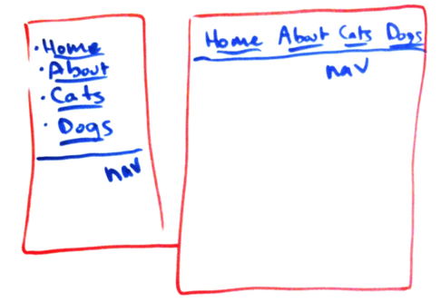
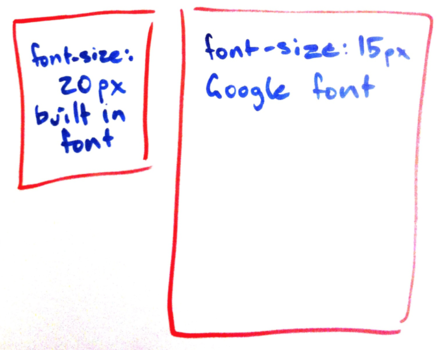
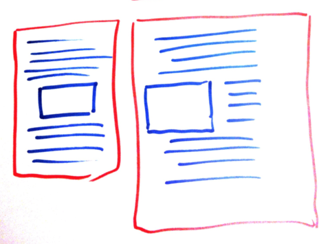
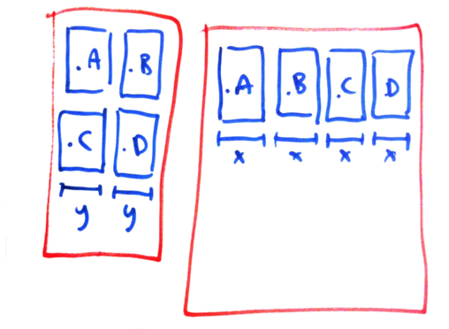
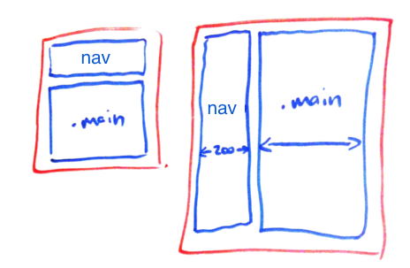
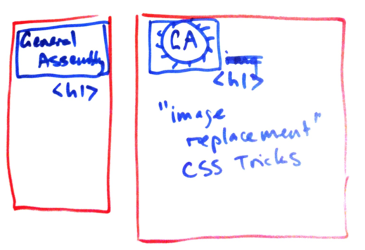
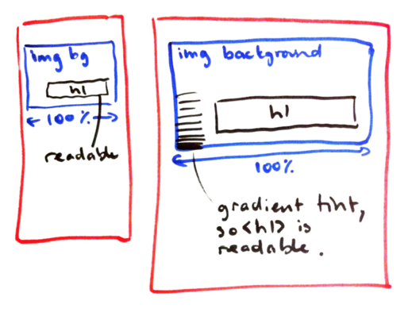
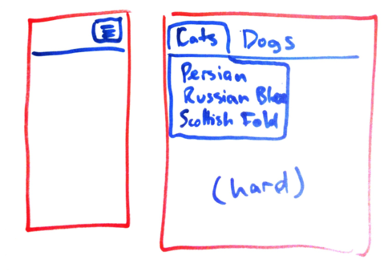

# CSS Challenges

For each of these designs,

1. Build the smaller layout first.
2. Use media queries to make larger design work. Both these designs should use
   the same HTML and CSS file. Resizing your web browser should dynamically
   switch between the two designs. You can use the features in Chrome dev
   tools if you find them useful.
3. Optionally, make copy of the same design that uses
   [Twitter Bootstrap](http://getbootstrap.com/)
   to help achieve the result. You might need significantly different markup.
   It's also possible that Twitter Bootstrap doesn't help much for the design in question.
   Follow the Bootstrap documentation's suggestions.
4. Optionally, read about and consider how other CSS systems like [Bourbon](http://bourbon.io/) might achieve these results.

Tips:

* The left is the "mobile" designs. The right is the "desktop" layout.
* Try 480px as the break point for all the exercises.
* Add class attributes to the HTML where necessary.
* Add colour boxes, borders, text, images, lorem ipsum text, or placeholder kittens as you see fit.
* Use [emmet](http://emmet.io/) if it's useful.

### (A) List nav and top nav

```html
<nav>
  <ul>
    <li><a href="#">Home</a></li>
    <li><a href="#">About</a></li>
    <li><a href="#">Cats</a></li>
    <li><a href="#">Dogs</a></li>
  </ul>
</nav>
```



### (B) Web fonts

```html
<h1>Fancy Heading</h1>
```

Q: Does your browser download the font file on the mobile version? Is it possible to save bandwidth here?



### (C) Floated image in an article

(Text courtesy of http://hipsum.co/)

```html
<article>
  <p>
    Freegan forage vice mlkshk. Kogi etsy small batch health goth, iPhone kale chips yr. Cred deep v mumblecore, yr four dollar toast bicycle rights umami. Portland 8-bit truffaut, gluten-free cronut bushwick four loko. Tofu hammock williamsburg blue bottle asymmetrical meditation. Lumbersexual single-origin coffee tumblr taxidermy, forage schlitz cold-pressed meh hashtag chartreuse listicle scenester. Single-origin coffee microdosing meggings whatever umami, iPhone waistcoat roof party 3 wolf moon celiac biodiesel schlitz before they sold out.
  </p>
  
  <p>
    Readymade swag seitan, authentic tumblr pickled tofu banjo sartorial asymmetrical ennui freegan chartreuse squid. Leggings brooklyn wolf taxidermy. Taxidermy cliche meditation, disrupt affogato sriracha leggings forage pork belly skateboard tumblr artisan bespoke williamsburg echo park. Food truck 90's ugh thundercats, polaroid shabby chic lomo vinyl cornhole taxidermy gastropub venmo pitchfork banjo health goth. Pinterest shabby chic pitchfork cliche. Schlitz blog bitters poutine stumptown chia. Humblebrag 90's meh paleo, truffaut fashion axe single-origin coffee sriracha small batch microdosing.
  </p>
  <p>
    Disrupt gentrify thundercats, DIY selvage polaroid banjo 3 wolf moon neutra banh mi hammock blue bottle freegan chartreuse 90's. Tumblr artisan tacos, humblebrag plaid church-key synth mustache everyday carry hashtag health goth food truck skateboard 3 wolf moon. Kitsch flexitarian pop-up kogi, hella occupy food truck celiac dreamcatcher lo-fi gentrify listicle beard marfa asymmetrical. Green juice knausgaard meh craft beer, 3 wolf moon vegan actually jean shorts ennui. Gastropub four dollar toast fanny pack skateboard kickstarter leggings, vice seitan farm-to-table chartreuse small batch plaid organic kombucha. Sartorial letterpress portland wayfarers, photo booth squid literally narwhal kale chips. XOXO venmo four loko sartorial narwhal asymmetrical knausgaard literally hella, vegan whatever jean shorts marfa locavore wayfarers.
  </p>
</article>
```



### (D) 4 columns

```html
<div>
  <div>A</div>
  <div>B</div>
  <div>C</div>
  <div>D</div>
</div>
```



### (E) Fixed sidebar and expanding main area

The main area should grow and shrink as you resize the layout, filling up whatever space is left over by the sidebar.

```html
<div class="page">
  <div class="sidebar">
    <nav>
      <ul>
        <li><a href="#">Home</a></li>
        <li><a href="#">About</a></li>
        <li><a href="#">Cats</a></li>
        <li><a href="#">Dogs</a></li>
      </ul>
    </nav>
  </div>
  <div class="main">
    <article>
      <header><h1>Why MUM is always WRONG</h1></header>
      <p>A</p>
      <p>B</p>
      <p>C</p>
    </article>
  </div>
</div>
```



### (F) Image replacement

This is a very common technique where a heading is replaced by an image logo
using CSS. Google "image replacement" if you need any advice. The CSS Tricks
web site is one of my favourites.

```html
<h1>General Assembly</h1>
<p>
Kick start your kick ass career in kicking ass today!
</p>
```



### (G) Hero image with text overlay (hard)

A large high res photo with the company's slogan (this one is [Coca Cola's](https://s-media-cache-ak0.pinimg.com/236x/93/fc/e1/93fce1f5eb039f47c4a49cf8c6a1c93a.jpg)) overlaid on the image.

The important thing is to keep the text legible. There are different strategies
for this. Tinting the image background is one option. A gradient tint is
another. Setting the background-color of the `<h1>` tag is yet another. Feel
free to try a few but for this exercise, the goal is to use a gradient tint and
to ensure that the heading text is still legible on a different size design.

```html
<div class="hero">
<h1>Open Happiness</h1>
</div>
```

```css
.hero {
  background-image: url(http://wallpaperfast.com/wp-content/uploads/2013/05/Great-Wave-Surfing-Desktop-Wallpaper.jpg);
  height: 500px;
  background-size: contain;
}
```



Q: This hero image is pretty big. Could we avoid downloading that on mobile devices?


### (H) CSS drop down menu (hard)

It's possible using :hover in CSS to build a functioning drop down menu. It's
pretty involved though.

Hint: The 3 stripes in the mobile layout is called a hamburger. Clicking it
should toggle the navigation. Toggling on click isn't something CSS can handle
by itself so feel free to use a bit of JavaScript or jQuery to make a click
handler for that bit.

Hint 2: Correct indentation really helps.

Hint 3: You might like to use the direct descendent selector. e.g. `li > ul`

```html
<nav>
  <ul>
    <li><a href="#">Home</a></li>
    <li><a href="#">About</a></li>
    <li>
      <a href="#">Cats</a>
      <ul>
        <li><a href="#">Persian</a></li>
        <li><a href="#">Russian Blue</a></li>
        <li><a href="#">Scottish Fold</a></li>
      </ul>
    </li>
    <li>
      <a href="#">Dogs</a>
      <ul>
        <li><a href="#">Poodle</a></li>
        <li><a href="#">Dalmation</a></li>
        <li><a href="#">Whippet</a></li>
      </ul>
    </li>
  </ul>
</nav>
```




### (I) Parallax scrolling (hard)

See http://www.marklawrencedesign.com/MLD_sandbox/MLD_2011/ for an example.

This sort of thing feels fashionable although personally my old man brain finds
it really confusing and it usually has terrible accessibility and takes
precious long seconds to load completely when the visitor hits the page &ndash;
seconds in which the visitor might "bounce".

Use all the JS you want to get this working. You might have to read some guides.


# Extra Reading

I'm a big fan of static site generators like [Middleman](https://middlemanapp.com/). If
these exercises have left you with any ideas for building a portfolio or identity web
site for yourself, consider using a static site generator.
